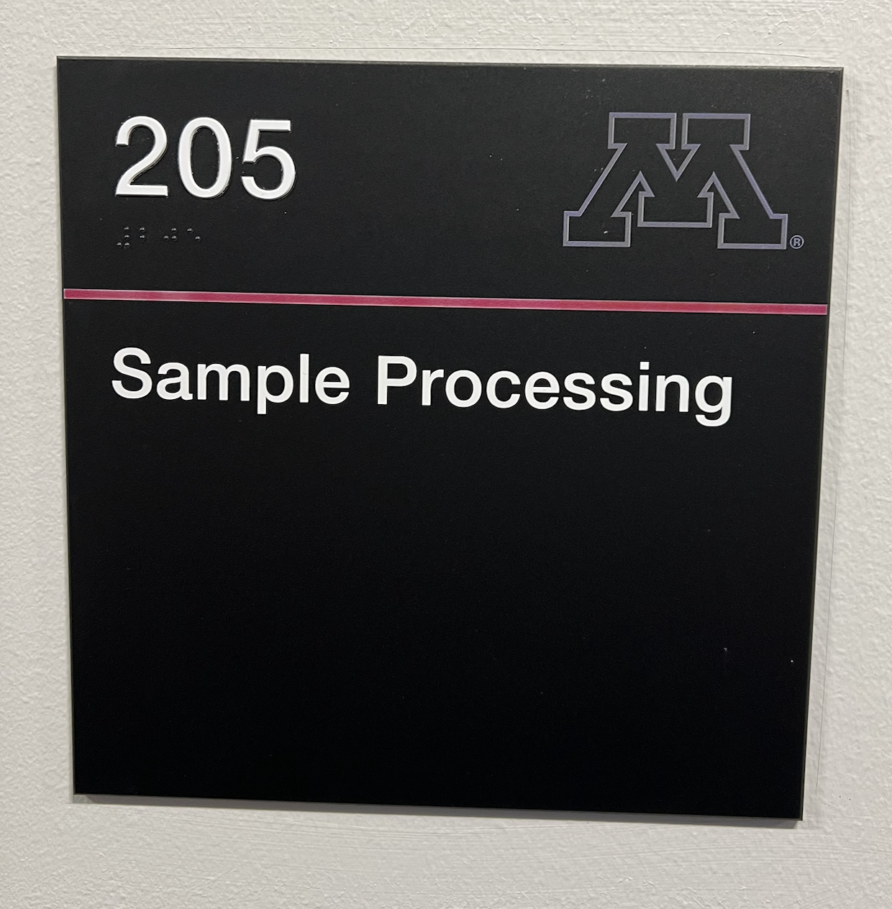

# Cleaning fNIRS Equipment 

## Cleaning Between Participants (During Data Collection)

### Cap Cleaning 

*Begin cleaning immediately after removing cap from particpant's head*

**Materials**
 - Fabric Disinfectant Spray
 - Alcohol Cleansing Wipes

1. Turn fNIRS cap inside out 
2. Spray fabric disinfectant on the inside of the cap 
3. Take alcohol lens cleaning wipes and wipe each individual light source (tip of the NIRS optode) 
4. Allow cap to dry completely before using an next participant 

### Other Materials (fNIRS)

**Materials**
- Alcohol Disinfectant Wipes
- Paper Towel

1. (If used) Disinfect the signal hair parting tools with an alcohol based disinfectant wipe 
2. Take a clean paper towel and wipe over the tip of the “magic marker” to remove color that has been in contact with children’s skin 

### iPad and Laptop

**Materials**
- Alcohol Cleansing Wipes

1. Take one alcohol based disinfectant wipe and wipe across the screen on the iPad
2. Take another wipe and disinfect the table space in front of the iPad 

## Cleaning After Data Collection (Deep Cleaning)

### Cap Cleaning
*Note: cap deep-cleaning can be done in Campbell Hall room 205*

**Materials**
- Basin filled with warm water 
- Baby shampoo
- Towel 
- Drying rack

1. Begin by removing all optodes and short distance channels from caps 
2. Investigate any potentially damaged parts at this time and remove/replace them 
3. Soak caps in a warm water + baby shampoo solution for 20 minutes
4. Rinse cap 4 times in warm water to remove all shampoo and residue
4. Remove cap from solution and dry with a gentle towel 
5. Hang to dry before next use

## Grommet and Optode Cleaning

**Materials**

- Isopropyl alcohol wipes 
- Towel to lay under all materials 

1. Collect all grommets, optodes, and short distance channels
2. **These materials can NOT can submerged in water**
3. Individually wipe these materials with isopropyl alcohol solution (70%) or general purpose cleaner 

*This is a good time to collect extraneous materials and problem solve broken parts.  If you do not know how to fix something please reach out to another RA or lab manager.*

