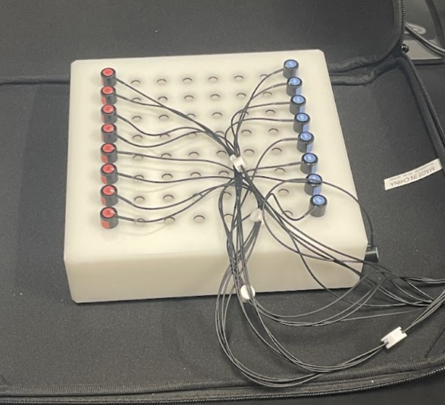
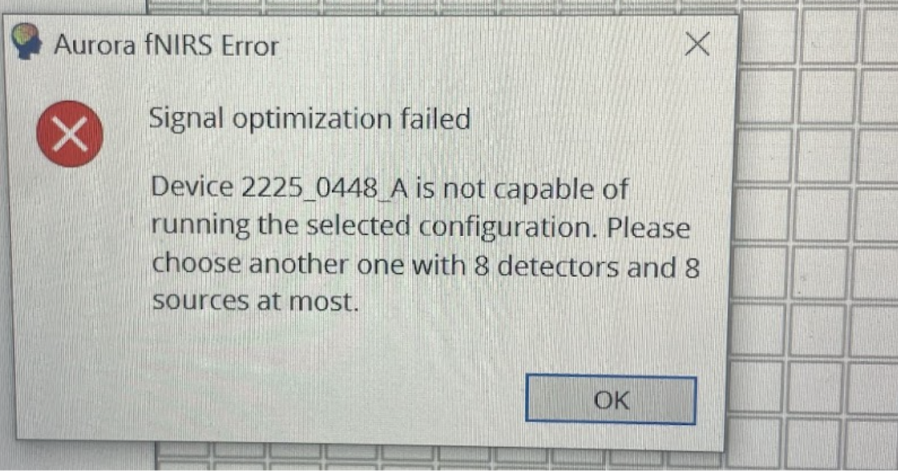
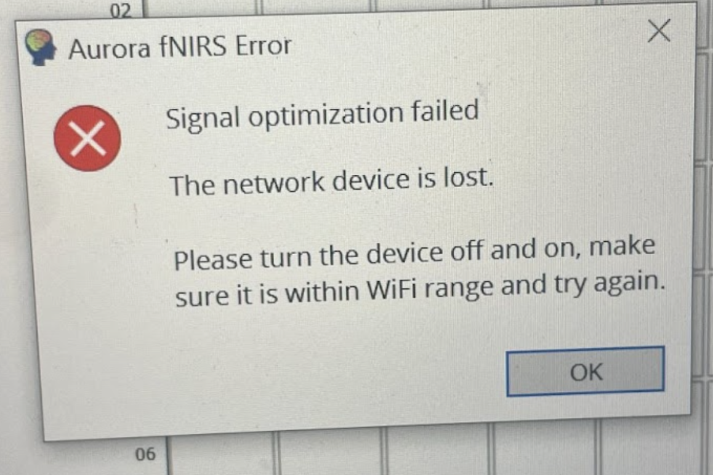

# Phantom Testing Protocol

## Materials
- Phantom block (pictures to go here)
- Optodes you will be testing, both source AND detector
- Blackout case
- fNIRS computer
- [Documentation sheet](https://docs.google.com/spreadsheets/d/19niNdWU5K-bbgTpHEOS49MJSUCEYLbQo6RfAbhuyJsE/edit?gid=0#gid=0)

1. Connect the fNIRS box to the fNIRS computer (NOT the EPRIME computer). For more detailed information on the computers used in fNIRS data colleciton, please see this [protocol](https://dance-lab.github.io/DANCE-Management/docs/fnirs_protocols/connecting_computers/). Open the program "Aurora" to prepare for testing. 

2. Prepare to begin testing by removing the phantom block from its shelf (it may be zipped into the blackout case) and lay the case, unzipped on the counter, with the phantom block in the center. 

3. Insert the nodes, both the source and the detectors, like so, into the phantom block. Basically line them by number 1-8 from top to bottom in the "Static phantom testing" cube
- S1
- S2
- S3
- etc...
- There should be no resistance as the block was made to fit the nodes perfectly

4. In Aurora, select the **Phantom88** program. There are a couple of other programs labeled "phantom" with different numbers after it, *ignore them*. We only have 8 detector & 8 source optodes for each participant.

5. **BEFORE running the test, you need to reduce light as much as possible.** Keep light from reaching the phantom box by closing it in the black case, zipping as much as possible without catching the cords

- It doesn't matter where the cords come out of the case, just that you are restricting as much light as possible.

6. Once the phantom box is covered and zipped, turn OFF the light in the room. (This might seem like a lot of prep, but remember what this system is? LIGHT. So we want to make sure the detectors are ONLY detecting the source nodes and not other lights.)

7. With the phantom box zipped away and lights turned off, you can now press the play button. If you get a warning about "high signal noise" or the like, take note but ignore it for now and press continue. 

8. Open the [**Phantom Testing Record Sheet**](https://docs.google.com/spreadsheets/d/19niNdWU5K-bbgTpHEOS49MJSUCEYLbQo6RfAbhuyJsE/edit?gid=0#gid=0) on your laptop and be prepared to record the results of your phantom testing

9. If you get a wall of green like this...

- Congratulations! The optodes are functioning correctly. You can record "Good Signal (ALL)" for the source and detector you are testing on the spreadsheet. If you get any other color, refer to the handy chart at the side of the screen. Please record ANY faulty optodes in the spreadsheet in the appropriate column. 
- When recording, remember that the grid has source and detector optode names labeled on the X and Y axis. Refer to these labels in order to create accurate documentation.

10. You may now perform the same process on the second source/detector pair

11. **If you encounter any optodes that are not working correctly (if the test returns anything other than a fully green grid for either set of source/detector pairs) you must immediately email the lab manager and inform them of this issue**
- Send an email to the lab manager with the subject: "DANCE Phantom Testing: Faulty Optodes [Date]"

## Troubleshooting

- If you get a wall of red, try switching out the sources or detectors, there might be a dud set.
- Another place to look for errors is the fNIRS box itself. This handy chart in the intro guide tells you when the box is ready, running, or when it's encountered an error

- **DON'T** try to use another phantom program. The hardware we have is only set up for 8 sources and 8 detectors at the **MAXIMUM**.

- The source and detector nodes are labeled. Keep track of which one you use and document accordingly.

- **If connected via wifi** Occasionally the wifi/TP link will not work correctly and the connection between the computer and the fNIRS device will be lost. First, check the lights on the fNIRS box to make sure there's not an error, but it is most likely Aurora just needs a restart. 

- **Connect via USB**: The most reliable way to connect the fNIRS device to the recording computer is with a USB cable. If you are unable to connect via wifi, switch to a USB connection and continue testing.