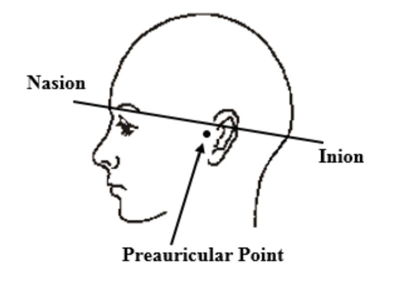
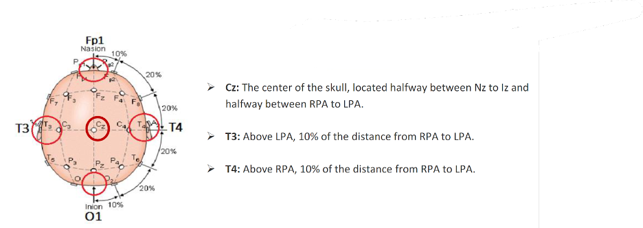

# Head Measuring & Cap Fitting Protocol 

### Measures of the head 
Ask the child if they are feeling comfortable during the procedures as well.

Measure the following with the tape measure in centimeters:

- Nasion (Nz, lowest point in between eyes) to Inion (Iz, the bump) - “mohawk”
- Nz to Cz (forehead to middle of head ( 1/2 of measurement A) 
- Left Preauricular Point (LPA) to Right Preauricular Point (RPA)  - “headband”
- 10% point - 10% of the measurement of point Nz to Iz. Mark the 10% dot above the Nz point with “magic” marker  
- Circumference - measure from the 10% dot and two fingers above the bump around the head 
- Record hair color (black, brown, dirty blonde, blond, white) hair type (kinky curls, curly, wavy, straight) and cap size )

### Record the measures on the [Head Measuring Form](https://docs.google.com/?pli=1) and find the best-fitting cap for the participant. 

| Circumference (cm) | Cap Size |
| ----------- | ----------- |
| 49.0-50.9 | Size 50 | 
| 51.0-52.9 | Size 52 |
| 53.0-54.9 | Size 54 |
| 55.0-56.9 | Size 56 |
| 57.0-58.9 | Size 58 |
| 59.0-60.9 | Size 60 |

When placing the cap on the participant's head, if there are bumps or raised areas, size down a cap size.

### Placing the cap 
Choose the **Caucasian cap** (for all races besides Asian) and **Asian cap** (for Asian participants)
Stand behind the participants. 
Ask the participant to tuck their hair behind their ears (if applicable)
Place both hands inside the cap and hold the cap up, slowly and carefully place the cap on the participant's head (if available use two RAs for this step)
Adjust by pulling the cap to fit the participant’s head. 
Be aware of the participant's earrings and piercings whenever placing or taking off the cap. 

### Ensuring correct placement 

Measure the Nz to point Cz (forehead to center of head) 
Measures the Iz to point Cz (bump on back of head to center of head)  
Both measurements should be equal.  If not, adjust the cap accordingly
Measure RPA to Cz (right ear to middle of head) 
Measure Cz to LPA (middle of head to left ear).
Both measurements should be equal.  If not, adjust the cap accordingly
Measure the 10% point to make sure that the cap is pulled down far enough 
The 10% point should fall on the “x” marking on the cap 

**If the cap is already populated, move to the next step in the protocol.  If the cap is not populated, remove cap and populate before placing back on the participant’s head.**

	
